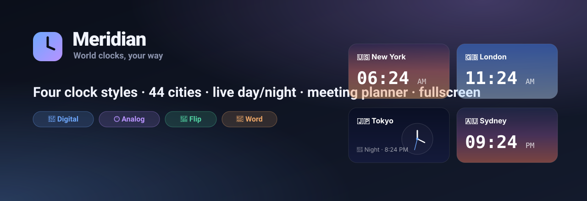

<div align="center">



<h1>🌍 Meridian</h1>

<p><b>A beautiful, fun world-clock app.</b><br/>
Four clock styles, 44 cities, live day/night skies, a meeting planner, and a full-screen desk-clock mode — all in a <b>single HTML file</b> with zero dependencies.</p>

<p>
  
  
  
  
</p>

<a href="#-quick-start"><b>Quick start</b></a> ·
<a href="#-features"><b>Features</b></a> ·
<a href="#-clock-styles"><b>Clock styles</b></a> ·
<a href="#-how-it-works"><b>How it works</b></a>

</div>

---

## ✨ Features

|  | Feature | What it does |
|---|---|---|
| 🕐 | **Four clock styles** | Switch instantly between Digital, Analog, Flip, and Word clocks — your choice is remembered. |
| 🌍 | **44 world cities** | Search by city or country and add cards for anywhere from Honolulu to Auckland. |
| 🌅 | **Live day/night skies** | Each card's background shifts through dawn → day → dusk → night based on that city's *real* local hour. |
| 🖥️ | **Fullscreen mode** | Click any clock to blow it up into a live desk/wall clock — arrow-key through cities, true browser fullscreen. |
| ⏱️ | **Meeting planner** | Drag a slider to find a time that works everywhere. Green = working hours, blue = awake, dim = asleep. |
| 🕹️ | **Sort & organize** | One click sorts your cities east-to-west by UTC offset. Add and remove with ease. |
| 💾 | **Remembers everything** | Your cities and chosen style persist across visits via `localStorage`. |
| ♿ | **Accessible** | Full keyboard navigation, visible focus rings, ARIA labels, and `prefers-reduced-motion` support. |

> **Always accurate.** Timezones use your browser's built-in IANA database via `Intl.DateTimeFormat`, so **Daylight Saving Time is handled automatically** for every city.

---

## 🕐 Clock styles

| Style | Vibe |
|---|---|
| 🔢 **Digital** | Crisp monospace time with a live seconds counter and tabular figures (no width jitter). |
| 🕐 **Analog** | Real SVG clock faces with smooth, correctly-angled hour, minute, and second hands. |
| 🎰 **Flip** | Retro split-flap display — each digit physically flips *only when it changes*. |
| 💬 **Word** | Reads the time aloud: *"It's quarter past nine, in the evening."* |

---

## 🚀 Quick start

Meridian is a single file. There's nothing to build.

**Option 1 — just open it**
```bash
open index.html
```

**Option 2 — run a tiny local server** (recommended, so everything behaves)
```bash
python3 -m http.server 5370
# then visit http://localhost:5370
```

That's it. No `npm install`, no bundler, no framework.

---

## 🎮 How to use

- **Add a city** — click the dashed **＋ Add city** card and search.
- **Switch styles** — use the toggle in the header (Digital / Analog / Flip / Word).
- **Go fullscreen** — click any clock face or its **⛶** button. Use **← / →** to move between cities, **Esc** to exit, and **⛶ Fullscreen** for true monitor-filling mode.
- **Plan a meeting** — drag the slider at the bottom; double-click it to snap back to *now*.
- **Sort** — hit **↕ Sort by time** to order cities by timezone.

---

## 🛠️ How it works

- **`Intl.DateTimeFormat`** with IANA timezone names drives every clock — accurate offsets and automatic DST, no timezone library needed.
- **Analog** faces are drawn with inline **SVG**; hands are positioned with a little trigonometry each tick.
- **Flip** clocks update *in place* and animate per-digit with a CSS `rotateX` flip, so only the digit that changed moves.
- **Sky gradients** map the local hour to a night / dawn / day / dusk palette.
- **State** (your cities + style) is saved to **`localStorage`** and restored on load.
- Everything is **vanilla HTML/CSS/JS** — one file, ~900 lines, no dependencies.

---

## 📁 Project structure

```
meridian-world-clock/
├── index.html    # the entire app — HTML, CSS, and JS
├── banner.svg    # the hero image above
└── README.md
```

---

## 🗺️ Roadmap ideas

- [ ] Auto-rotate "screensaver" mode that cycles cities in fullscreen
- [ ] Stopwatch & countdown timer
- [ ] Alarms
- [ ] Light theme toggle
- [ ] Shareable meeting links

---

## 📄 License

[MIT](LICENSE) — do whatever you like. Built with vanilla web tech and a lot of care.

<div align="center"><sub>Made with ☕ and 🕐</sub></div>
